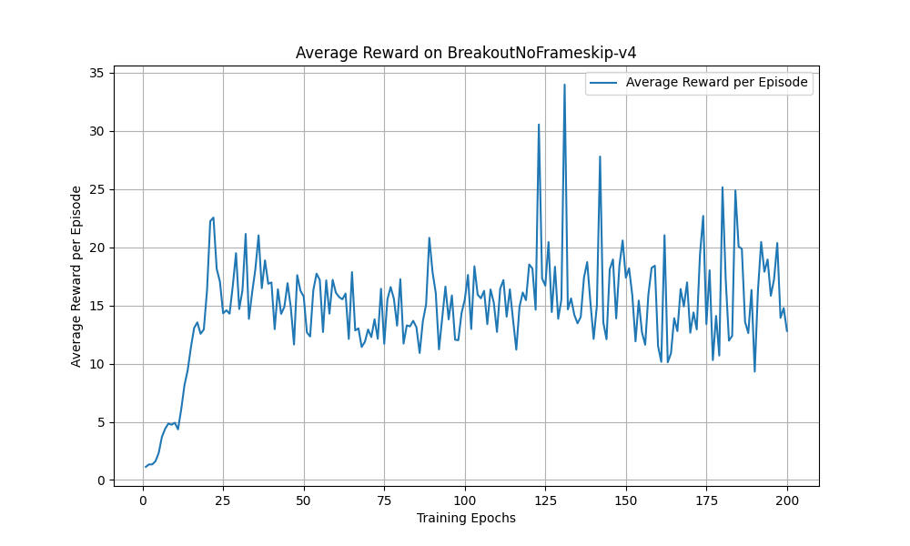
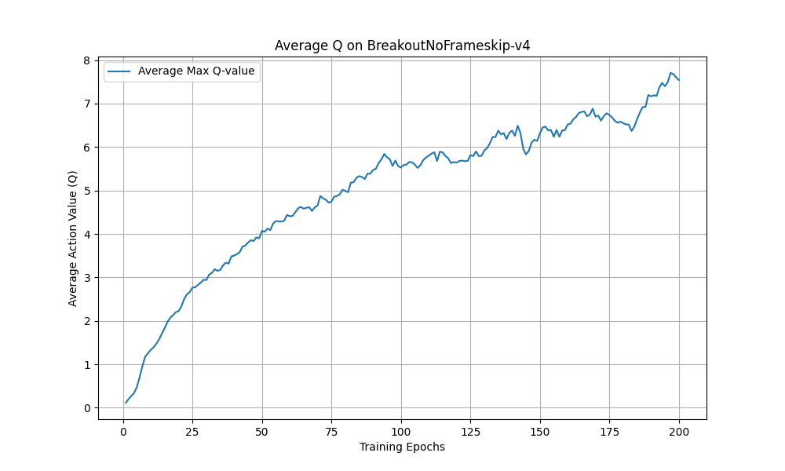

# Deep Q-Network (MLX Implementation)

This repo implements the **Deep Q-Network** architecture and training procedure from the paper [Playing Atari with Deep Reinforcement Learning](https://arxiv.org/abs/1312.5602) by Mnih et al. using the [MLX array framework](https://github.com/ml-explore/mlx), which allows for training and evaluation locally on Apple Silicon devices (M1+).

Mainly written as an opportunity to learn both MLX and the DQN architecture at once 😄

## Setup

The project uses [uv](https://github.com/astral-sh/uv) for dependancy management. You can follow [these](https://github.com/astral-sh/uv?tab=readme-ov-file#installation) instructions to install it.

## Training

In the paper, they train a model to play seven ATARI games: "Beam Rider, Breakout, Enduro, Pong, Q*bert, Seaquest, Space Invaders".

I'm trained Breakout on my laptop, a MacBook Pro M3 Max with 48GB of unified memory, which took about 4.5 hours.

One note: I've mostly tried to use the parameters exactly as per the paper, how they use a replay buffer size of 1M, but I could only manage 100k without running out of memory.

## Beam Rider

```bash
uv run main.py --mode train --env BeamRiderNoFrameskip-v4
```

Looking at the loss curve, it seems to have stopped learning. I'll try a lower learning rate.
Much better after doing that, but still 4x off the paper's score. Try remove frameskip.


### Breakout

```bash
uv run main.py --mode train --env BreakoutNoFrameskip-v4
```

<p align="center">
  
  
</p>

The best performing evaluation gets a reward of 240, which aligns with the results in the paper. You can see from watching the video, that it figures out a "tunneling strategy", aside from that, it actually seems quite bad at Breakout.

https://github.com/user-attachments/assets/8f9418af-d715-410c-8054-a1e30ae49dda

## Eval

```
uv run main.py --mode eval --env BreakoutNoFrameskip-v4
```


## Linting and Formatting

This project uses [ruff](https://github.com/astral-sh/ruff) for linting and formatting.

To check for linting errors:

```bash
uv run ruff check .
```

To automatically fix linting errors and format the code:

```bash
uv run ruff format .
uv run ruff check . --fix
```

You can also configure your editor to use ruff for linting and formatting on save.

## Type Checking

This project uses [mypy](https://mypy-lang.org/) for static type checking.

To run mypy:

```bash
uv run mypy .
```
