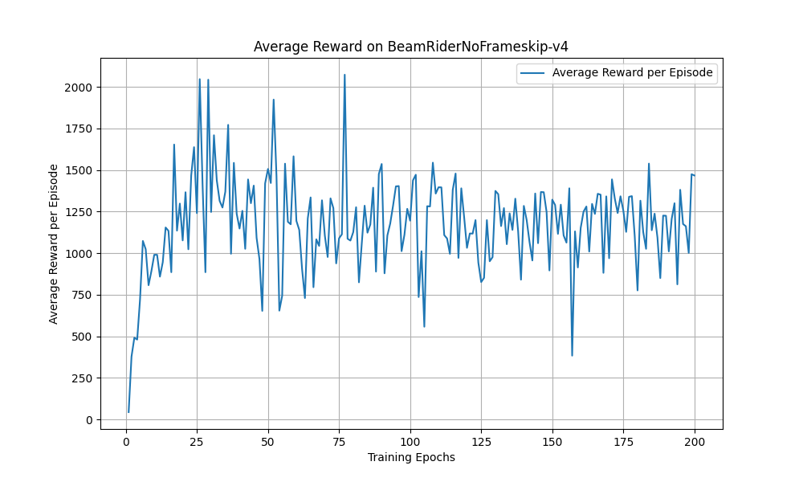
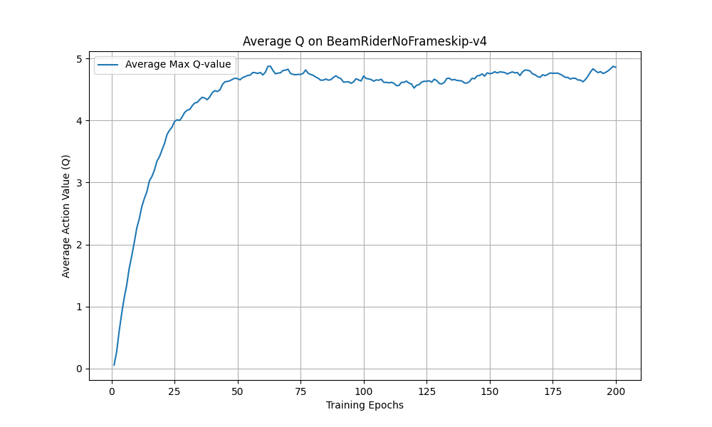
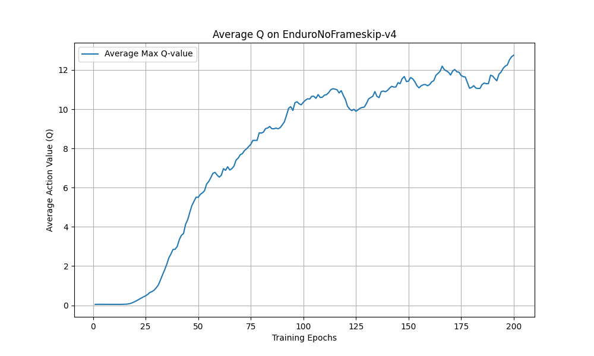

# Deep Q-Network (MLX Implementation)

This repo implements the **Deep Q-Network** architecture and training procedure from the paper [Playing Atari with Deep Reinforcement Learning](https://arxiv.org/abs/1312.5602) by Mnih et al. using the [MLX array framework](https://github.com/ml-explore/mlx), which allows for training and evaluation locally on Apple Silicon devices (M1+).

Mainly written as an opportunity to learn both MLX and the DQN architecture at once 😄

## Setup

The project uses [uv](https://github.com/astral-sh/uv) for dependancy management. You can follow [these](https://github.com/astral-sh/uv?tab=readme-ov-file#installation) instructions to install it.

## Training and Eval

To train a model, use the following command:

```bash
uv run main.py --mode train --env $ale_env_name
```

To evaluate a model:

```bash
uv run main.py --mode eval --env $ale_env_name --load-path path/to/weights
```

## Results

In the paper, they train a model to play seven ATARI games: "Beam Rider, Breakout, Enduro, Pong, Q*bert, Seaquest, Space Invaders", so far I've trained Beam Rider, Breakout and Enduro. I trained the models on a laptop - a MacBook Pro M3 Max with 48GB of unified memory, which took about 10-12 hours each. I tried to use the parameters exactly as per the paper, how they use a replay buffer size of 1M, but I could only manage 200k without running out of memory. My results tend to be a bit worse than the paper, and I'm pretty sure it's because of the smaller replay buffer, especially for games that have multiple stages like Beam Rider.

### Beam Rider

#### Commands

```bash
# Train
uv run main.py --mode train --env BeamRiderNoFrameskip-v4
# Eval
uv run main.py --mode eval --env BeamRiderNoFrameskip-v4 --load-path weights/BeamRiderNoFrameskip-v4/epoch_200.safetensors
```

#### Results

* My avg reward: **1261**
* Paper avg reward: **4092**

From watching the game play video, I'm pretty convinced that a bigger replay buffer would help. It seems to do really well at the initial part of the game, but really struggle in later stages.

#### Training metrics

<p align="center">
  
  
</p>

#### Gameplay Video

### Enduro

#### Commands

```bash
# Train
uv run main.py --mode train --env EnduroNoFrameskip-v4
# Eval
uv run main.py --mode eval --load-path weights/EnduroNoFrameskip-v4/epoch_200.safetensors --env EnduroNoFrameskip-v4
```

#### Results

* My avg reward: **232**
* Paper avg reward: **470**

#### Training metrics

<p align="center">
  
  
</p>

#### Gameplay Video


## Linting and Formatting

This project uses [ruff](https://github.com/astral-sh/ruff) for linting and formatting.

To check for linting errors:

```bash
uv run ruff check .
```

To automatically fix linting errors and format the code:

```bash
uv run ruff format .
uv run ruff check . --fix
```

You can also configure your editor to use ruff for linting and formatting on save.

## Type Checking

This project uses [mypy](https://mypy-lang.org/) for static type checking.

To run mypy:

```bash
uv run mypy .
```
